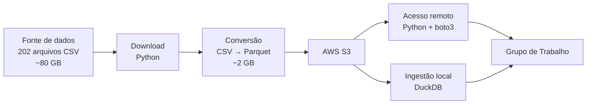
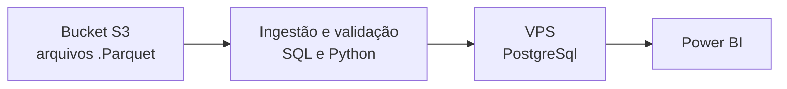

# Painel de Medicamentos Controlados (Concurso de Dados Abertos)

  

🔗 **Acesse a versão interativa completa:** [Painel de Medicamentos Controlados (Power BI)](https://app.powerbi.com/view?r=eyJrIjoiMjQ2YjM2ZWQtMDA2MS00NTFlLThmNTQtZWQ2NjAyNDExYjgwIiwidCI6ImM5YjcyYjJhLTBiMzQtNDQyNS1iOWM3LWMyNDU5ZWMwMTUxZiJ9)

---

## Sobre o Projeto
A ideia para o projeto surgiu com o lançamento do 2º Concurso de Reúso de Dados Abertos promovido pela Controladoria-Geral da União (CGU).
Este projeto consiste em um dashboard interativo focado na análise de venda e distribuição de medicamentos sujeitos a controle especial no Brasil no período de 2017 a 2021. A solução visa promover a transparência, o controle social e apoiar a gestão pública de saúde na identificação de padrões de consumo, potenciais vazios assistenciais e gargalos na distribuição.

## Principais perguntas de Negócio Respondidas
* **Padrões de Vendas:** Quais princípios ativos de medicamentos controlados apresentam maior volume de vendas? Há mais vendas realizadas de medicamentos na forma industrializada ou manipulada?
* **Análise Temporal:** Houve picos atípicos na venda de medicamentos ao longo do período analisado?
* **Análise Geográfica:** Qual estado lidera o volume de vendas de medicamentos controlados no país?
* **Conselhos Prescritores:** Qual conselho profissional é responsável pelo maior volume de prescrições de fármacos controlados?
* **CID-10:** Quais são as patologias/diagnósticos (CID-10) mais registrados nas prescrições?

## Datasets Utilizados
Os dados utilizados são oriundos do Portal Brasileiro de Dados Abertos (`dados.gov.br`):
* **Datasets Principais:**
    * [Venda de Medicamentos Controlados, Antimicrobianos e Agonistas de GLP-1 - Medicamentos Manipulados](https://dados.gov.br/dados/conjuntos-dados/venda-de-medicamentos-controlados-e-antimicrobianos---medicamentos-manipulados)
    * [Venda de Medicamentos Controlados, Antimicrobianos e Agonistas de GLP-1 - Medicamentos Industrializados](https://dados.gov.br/dados/conjuntos-dados/venda-de-medicamentos-controlados-e-antimicrobianos---medicamentos-industrializados)
* **Fonte:** Agência Nacional de Vigilância Sanitária (Anvisa) / Ministério da Saúde

## Tecnologias Utilizadas
* **Linguagem / Processamento:** Python / SQL
* **Banco de Dados:** PostgreSQL
* **Tratamento de Dados:** Pandas
* **Visualização / Dashboard:** Power BI

---

<strong>Pipeline, ingestão e disponibilização </strong>

Os dados foram obtidos a partir da fonte mencionada anteriormente, totalizando 202 arquivos CSV e aproximadamente 80 GB de dados brutos.

Como os arquivos seriam utilizados por um grupo de analistas distribuído geograficamente, manter uma cópia completa do dataset em cada máquina não era uma solução conveniente. Além do espaço necessário, isso faria com que cada integrante precisasse realizar individualmente o download e a preparação dos dados.

A primeira etapa, portanto, foi transformar os arquivos para um formato mais adequado à exploração analítica.

<strong>Otimização para o grupo de trabalho</strong>

O script `01-raw-csv-to-parquet.py` , disponível neste repositório, foi desenvolvido para realizar a conversão dos arquivos CSV para Parquet.

> *Além de ser um formato orientado a colunas e mais adequado para consultas analíticas, a conversão proporcionou uma redução expressiva no volume armazenado.*

Os arquivos Parquet foram então disponibilizados em um Amazon S3, que passou a funcionar como uma camada centralizada de armazenamento. O processo de upload também realizou o tratamento dos tipos dos dados antes da persistência, como demonstra o script `02-bronze-s3-storage-parquet-processing.py`.
A partir do bucket, foram disponibilizadas duas formas de acesso para o grupo de trabalho:

Consulta remota

> *Um script Python utilizando boto3 permite consultar os dados diretamente no S3, sem a necessidade de manter uma cópia completa dos arquivos localmente.*

Exploração local

> *Para situações em que fosse conveniente trabalhar localmente, também foi desenvolvido um script responsável por realizar a ingestão dos dados do bucket e criar automaticamente um banco DuckDB na máquina do contributor.*

A arquitetura eliminou a necessidade de distribuir os 82 GB de dados brutos individualmente entre os integrantes do grupo.

Ambos podem ser conferidos em `03-local-duckdb.py`, permitindo que o processo de preparação e disponibilização seja reproduzido sem que cada usuário precise conhecer ou executar manualmente todas as etapas do pipeline.

<strong>Delimitação de escopo e disponibilidade da fonte</strong>

## 

A fonte apresenta cobertura histórica contínua entre 2014 e 2021. Após esse período, não foram identificados dados disponíveis entre 2022 e 2025, com a disponibilização dos registros sendo retomada somente em 2026.

Essa lacuna não foi causada por uma etapa de filtragem ou tratamento realizada neste projeto. Trata-se de uma descontinuidade observada na própria fonte de dados, relacionada à disponibilidade, curadoria e governança da informação.

Para garantir comparabilidade temporal e evitar a interpretação de períodos incompletos como séries históricas contínuas, a análise principal foi concentrada no período 2014–2021.

Os dados disponibilizados em 2026 foram mantidos como referência da disponibilidade atual da fonte, mas não foram incorporados à série histórica principal:

                                                    
    2014        2016        2018        2020        2021        2022        2024        2026
     │-----------│-----------│-----------│-----------│-----------│-----------│-----------│-------
     █████████████████████████████████████████████████████████·························· ██████
    <───── Período de divulgação contínua até out/2021 ────>                  Retorno da divulgação
<!--
Decisões tomadas perante aos valores ausentes, ou com baixa qualidade (idade, cid ...)
-->

<strong>Inconsistências, dados inválidos e erros de preenchimento</strong>

Algumas dimensões importantes foram eliminadas da análise devido à dados inválidos.
Temos como o exemplo mais claro dessa questão a coluna `idade`, que além de ter mais de um quarto dos registros nulos, fornece idades incompatíveis com a realidade (variando de 0 a 999), como demonstrado abaixo:

Outros pontos de incidencia de alto número de valores nulos foi a coluna `ds_dcb` que além de ter 94,6% de valores nulos n'ao estava especificada em nenhum dos dicionários de dados disponibilizados, e a coluna `sexo`, com 25,9% de valores nulos.

Verificado tais ocorrências, o grupo optou por não incluir essas variáveis nas análises.

<strong>Armazenamento e produto</strong>

Após exploração dos dados, foi decidido o armazenamento em PostgreSql em uma VPS, e dado início ao desenho do produto final, um dashboard em Power BI, para consumir desses mesmos dados, respeitando todos os critérios de boas práticas para tal, desde a modelagem em tabelas fato e dimensão, separadas por contexto (manipulados e industrializados) como uso de formato PBIP para versionamento e manutenção usando TMDL e GIT.

