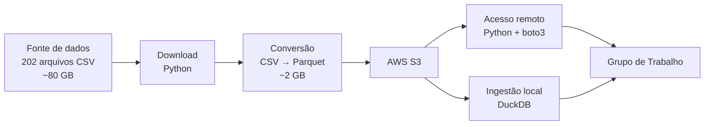
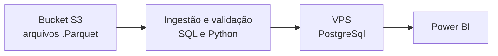

# Projeto de Dados - Histórico de venda de medicamentos controlados (Concurso de Dados Abertos)

A ideia para o projeto surgiu com o lançamento do 2º Concurso de Reúso de Dados Abertos promovido pela Controladoria-Geral da União (CGU).

---

## 📌 Sobre o Projeto
Este projeto consiste em um dashboard interativo focado na análise do consumo e distribuição de medicamentos sujeitos a controle especial no Brasil. A solução visa promover a transparência, o controle social e apoiar a gestão pública de saúde na identificação de padrões de consumo, potenciais vazios assistenciais e gargalos na distribuição.

## 🎯 Perguntas de Negócio Respondidas
* **Padrões de Consumo:** Quais classes terapêuticas de medicamentos controlados apresentam maior volume de vendas por estado/município?
* **Análise Temporal:** Houve picos atípicos na dispensação de determinados medicamentos ao longo do período analisado?

## 🗃️ Datasets Utilizados
Os dados utilizados são oriundos do Portal Brasileiro de Dados Abertos (`dados.gov.br`):
* **Datasets Principais:**
    * Venda de Medicamentos Controlados, Antimicrobianos e Agonistas de GLP-1 - Medicamentos Manipulados 
    * Venda de Medicamentos Controlados, Antimicrobianos e Agonistas de GLP-1 - Medicamentos Industrializados
* **Fonte:** Agência Nacional de Vigilância Sanitária (Anvisa) / Ministério da Saúde
* **Link para os Datasets:**
    * https://dados.gov.br/dados/conjuntos-dados/venda-de-medicamentos-controlados-e-antimicrobianos---medicamentos-manipulados
    * https://dados.gov.br/dados/conjuntos-dados/venda-de-medicamentos-controlados-e-antimicrobianos---medicamentos-industrializados

## 🛠️ Tecnologias Utilizadas
* **Linguagem / Processamento:** Python / SQL
* **Visualização / Dashboard:** 
* **Tratamento de Dados:** Pandas 

<strong>Pipeline e Arquitetura</strong>

## Pipeline e disponibilização dos dados

Os dados foram obtidos a partir da fonte mencionada anteriormente, totalizando 202 arquivos CSV e aproximadamente 80 GB de dados brutos.

Como os arquivos seriam utilizados por um grupo de analistas distribuído geograficamente, manter uma cópia completa do dataset em cada máquina não era uma solução conveniente. Além do espaço necessário, isso faria com que cada integrante precisasse realizar individualmente o download e a preparação dos dados.

A primeira etapa, portanto, foi transformar os arquivos para um formato mais adequado à exploração analítica.

Otimização e armazenamento

Um script Python, disponível neste repositório, foi desenvolvido para realizar a conversão dos arquivos CSV para Parquet.

> *Além de ser um formato orientado a colunas e mais adequado para consultas analíticas, a conversão proporcionou uma redução expressiva no volume armazenado.*

Os arquivos Parquet foram então disponibilizados em um Amazon S3, que passou a funcionar como uma camada centralizada de armazenamento. O processo de upload também realizou o tratamento dos tipos dos dados antes da persistência.
A partir do bucket, foram disponibilizadas duas formas de acesso para o grupo de trabalho:

Consulta remota

    Um script Python utilizando boto3 permite consultar os dados diretamente no S3, sem a necessidade de manter uma cópia completa dos arquivos localmente.

Exploração local

    Para situações em que fosse conveniente trabalhar localmente, também foi desenvolvido um script responsável por realizar a ingestão dos dados do bucket e criar automaticamente um banco DuckDB na máquina do contributor.

A arquitetura eliminou a necessidade de distribuir os 82 GB de dados brutos individualmente entre os integrantes do grupo.

Os scripts responsáveis por essas etapas estão disponíveis no repositório, permitindo que o processo de preparação e disponibilização seja reproduzido sem que cada usuário precise conhecer ou executar manualmente todas as etapas do pipeline.

## Delimitação de escopo e qualidade de Dados

A fonte apresenta cobertura histórica contínua entre 2014 e 2021. Após esse período, não foram identificados dados disponíveis entre 2022 e 2025, com a disponibilização dos registros sendo retomada somente em 2026.

Essa lacuna não foi causada por uma etapa de filtragem ou tratamento realizada neste projeto. Trata-se de uma descontinuidade observada na própria fonte de dados, relacionada à disponibilidade, curadoria e governança da informação.

Para garantir comparabilidade temporal e evitar a interpretação de períodos incompletos como séries históricas contínuas, a análise principal foi concentrada no período 2014–2021.

Os dados disponibilizados em 2026 foram mantidos como referência da disponibilidade atual da fonte, mas não foram incorporados à série histórica principal:

                                                    
    2014        2016        2018        2020        2021        2022        2024        2026
     │-----------│-----------│-----------│-----------│-----------│-----------│-----------│-------
     █████████████████████████████████████████████████████████·························· ██████
    <───── Período de divulgação contínua até out/2021 ────>                  Retorno da divulgação
<!--
Decisões tomadas perante aos valores ausentes, ou com baixa qualidade (idade, cid ...)
-->
## Armazenamento e plataforma de análise

<!--
## 🚀 Como Executar o Projeto (Replicabilidade)
> *Esta seção atende ao critério de Replicabilidade e Escalabilidade do Concurso da CGU.*
-->
